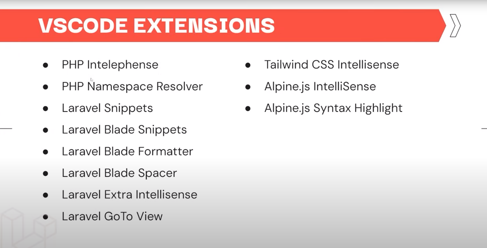

## 🎥 Video #01: Intro

**🧠 Konsep Utama:**

- Laravel: Web aplikasi Framework
- Tailwind, Alpine.js, Menggunakan starter pack breeze
- Berbasis Komponen, tidak menggunakan sintaks pewaarisan blade

- note: Watch Fitur laravel, PHP MVC, tailwindcss, 1 jam alpine.js

- alpine.js: library/framework javascript
  Requirement laravel
- PHP
- SQL
- Composer
- NodeJS

Versi software

- Laragon
- Laravel Herd
- TablePlus
- PHPStorm

**📌 Sintaks Penting:**

- `[Potongan kode atau sintaks yang penting]`
- `[Penjelasan singkat tentang fungsinya]`

**📘 Best Practices:**

- [Tips atau praktik terbaik yang disebutkan dalam video]

**💡 Ide untuk Proyek:**

- [Bagaimana konsep ini dapat diterapkan dalam proyek Anda]
